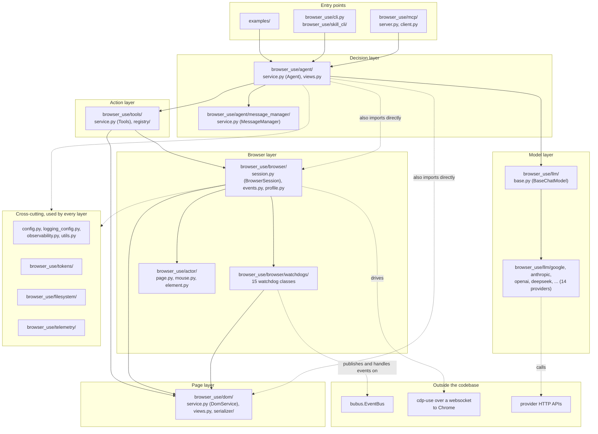

# Logical Architecture

Layers and packages of browser-use, with dependency direction. Every box is a real directory or
module in the repository. Arrows point from the package that imports to the package it imports.

## Dependency notes

- The downward arrows come from counting `from browser_use.<package>` imports: `agent` imports
  `browser` 8 times, `dom` 5, `llm` 15, `tools` 3; `tools` imports `browser` 7 times and `dom` 4;
  `browser` imports `dom` 9 times.
- `dom` and `actor` refer back to `BrowserSession` only inside `if TYPE_CHECKING:` blocks
  (`dom/service.py:29`, `actor/page.py`), so those are type hints, not runtime dependencies.
- The only `llm` to `agent` imports are inside `browser_use/llm/tests/`, so the model layer does
  not depend on the agent in shipped code.
- `browser/watchdog_base.py:12` imports `BrowserSession` at module level while
  `session.py:1695` imports every watchdog inside `attach_all_watchdogs()`. That pair is a real
  cycle, documented as this assignment's architectural concern.
