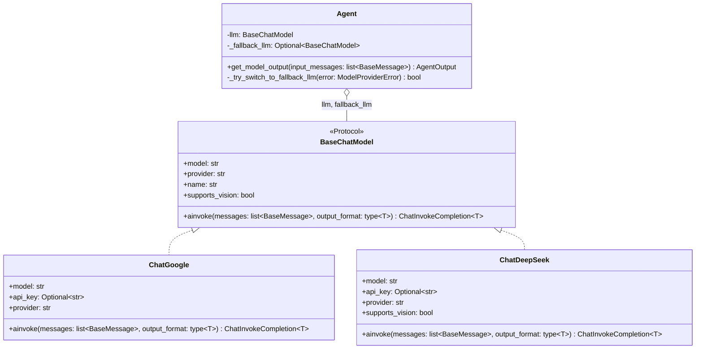
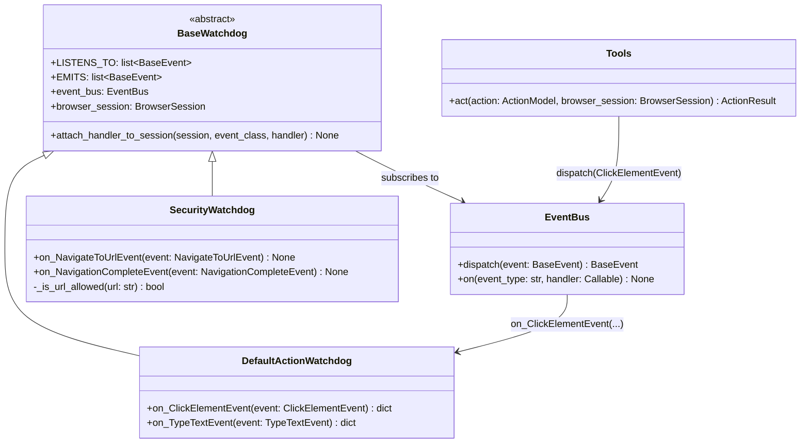
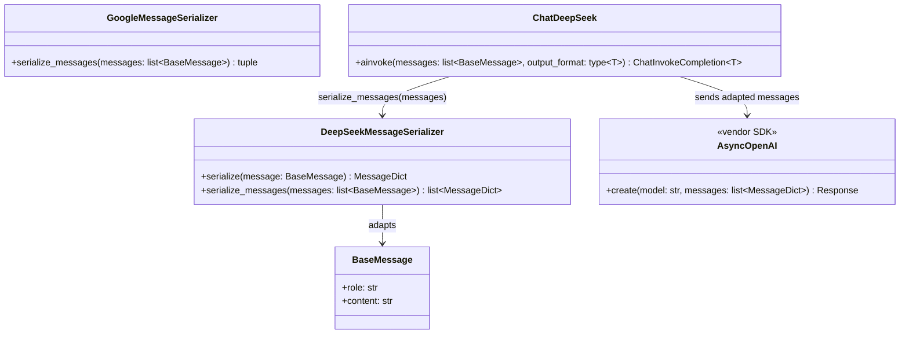

# Design Pattern Diagrams

Design class diagrams for the three GoF patterns found in browser-use. Rendered copies:
`pattern-1-strategy.png`, `pattern-2-observer.png`, `pattern-3-adapter.png`.

## Strategy: swappable AI models

## Observer: the event bus and the watchdogs

## Adapter: per-provider message serializers

