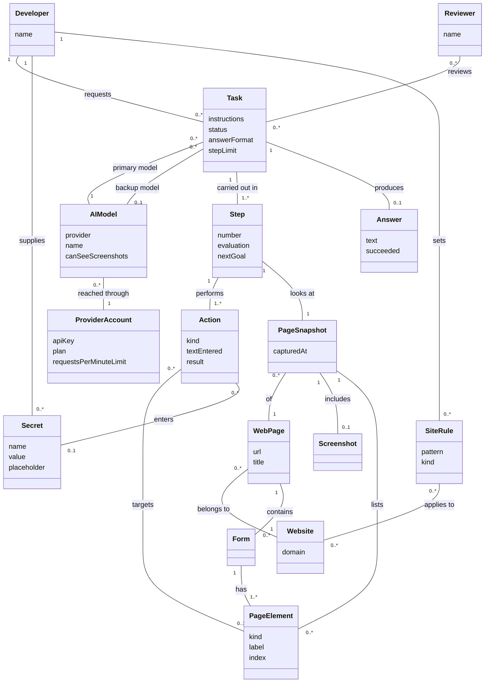

# Domain Model: AI Browser Automation

Tightened from the noun analysis of the three fully-dressed use cases
(Look Up Information Online, Submit Web Form, Collect Data From Website).

```mermaid
classDiagram
    class Developer {
        name
    }
    class Reviewer {
        name
    }
    class Task {
        instructions
        status
        answerFormat
        stepLimit
    }
    class Secret {
        name
        value
        placeholder
    }
    class AIModel {
        provider
        name
        canSeeScreenshots
    }
    class ProviderAccount {
        apiKey
        plan
        requestsPerMinuteLimit
    }
    class Step {
        number
        evaluation
        nextGoal
    }
    class Action {
        kind
        textEntered
        result
    }
    class PageSnapshot {
        capturedAt
    }
    class Screenshot
    class WebPage {
        url
        title
    }
    class Website {
        domain
    }
    class Form
    class PageElement {
        kind
        label
        index
    }
    class SiteRule {
        pattern
        kind
    }
    class Answer {
        text
        succeeded
    }

    Developer "1" -- "0..*" Task : requests
    Developer "1" -- "0..*" Secret : supplies
    Developer "1" -- "0..*" SiteRule : sets
    Reviewer "0..*" -- "0..*" Task : reviews
    Task "0..*" -- "1" AIModel : primary model
    Task "0..*" -- "0..1" AIModel : backup model
    AIModel "0..*" -- "1" ProviderAccount : reached through
    Task "1" -- "1..*" Step : carried out in
    Task "1" -- "0..1" Answer : produces
    Step "1" -- "1..*" Action : performs
    Step "1" -- "1" PageSnapshot : looks at
    PageSnapshot "0..*" -- "1" WebPage : of
    PageSnapshot "1" -- "0..1" Screenshot : includes
    PageSnapshot "1" -- "0..*" PageElement : lists
    WebPage "0..*" -- "1" Website : belongs to
    WebPage "1" -- "0..*" Form : contains
    Form "1" -- "1..*" PageElement : has
    Action "0..*" -- "0..1" PageElement : targets
    Action "0..*" -- "0..1" Secret : enters
    SiteRule "0..*" -- "0..*" Website : applies to
```
