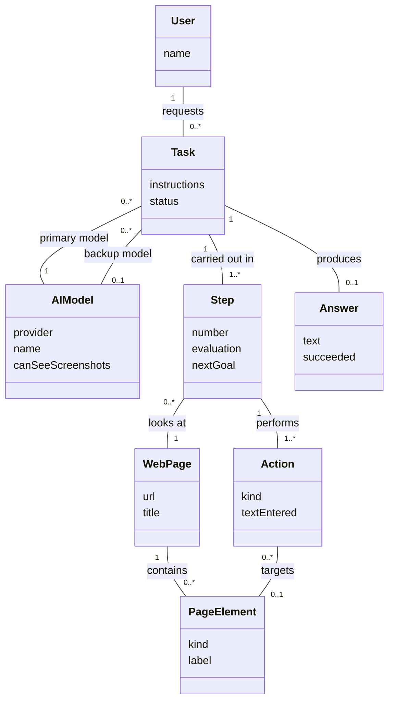

# Domain Model: AI Browser Automation

```mermaid
classDiagram
    class User {
        name
    }
    class Task {
        instructions
        status
    }
    class AIModel {
        provider
        name
        canSeeScreenshots
    }
    class Step {
        number
        evaluation
        nextGoal
    }
    class Action {
        kind
        textEntered
    }
    class WebPage {
        url
        title
    }
    class PageElement {
        kind
        label
    }
    class Answer {
        text
        succeeded
    }

    User "1" -- "0..*" Task : requests
    Task "0..*" -- "1" AIModel : primary model
    Task "0..*" -- "0..1" AIModel : backup model
    Task "1" -- "1..*" Step : carried out in
    Step "1" -- "1..*" Action : performs
    Step "0..*" -- "1" WebPage : looks at
    WebPage "1" -- "0..*" PageElement : contains
    Action "0..*" -- "0..1" PageElement : targets
    Task "1" -- "0..1" Answer : produces
```
