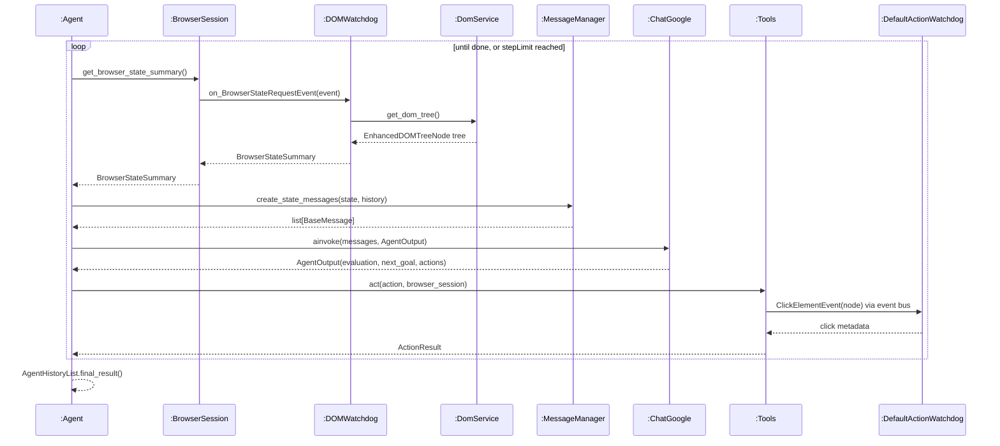
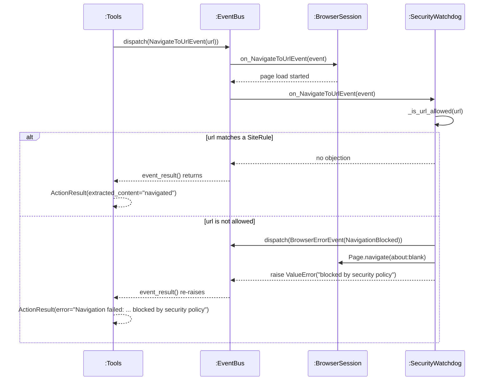

# Interaction Diagrams

Object-level collaborations inside browser-use. Every participant is a real class in the
repository, with the file and line where it is defined.

## 1. Inside `runTask(stepLimit)` — one agent step

Expands the `runTask(stepLimit)` system event from SSD 2 (Submit Web Form). Last week the whole
system was one box; this is what happens inside it when that event arrives.

Participants: `Agent` (`agent/service.py:2503`), `BrowserSession` (`browser/session.py:1595`),
`DOMWatchdog` (`browser/watchdogs/dom_watchdog.py:244`), `DomService` (`dom/service.py:703`),
`MessageManager` (`agent/message_manager/service.py:424`), `ChatGoogle` (`llm/google/chat.py`),
`Tools` (`tools/service.py:2178`), `DefaultActionWatchdog`
(`browser/watchdogs/default_action_watchdog.py:337`).

## 2. Inside the `navigate(url)` action — the security check

A different operation: what happens when the agent asks to open a page, and how a site outside
`allowed_domains` is handled.

Participants: `Tools` (`tools/service.py:507`), `EventBus` (bubus), `BrowserSession`
(`browser/session.py:905`), `SecurityWatchdog` (`browser/watchdogs/security_watchdog.py:35`).

Note on ordering: `BrowserSession.on_NavigateToUrlEvent` runs before
`SecurityWatchdog.on_NavigateToUrlEvent`, so the page starts loading before the check runs. I
confirmed this with `allowed_domains=['example.com']`: the tab was switched to `about:blank` after
the fact, and the blocked site still received the request.
