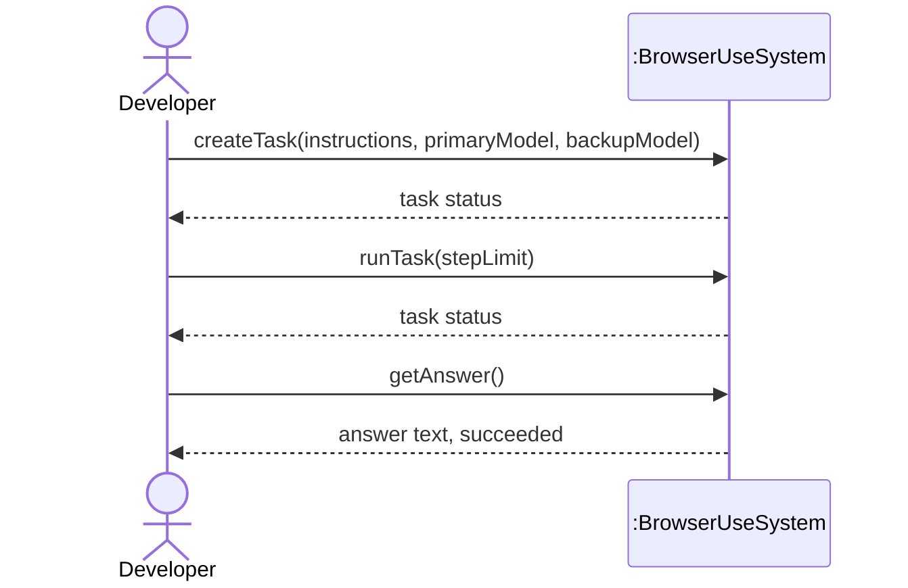
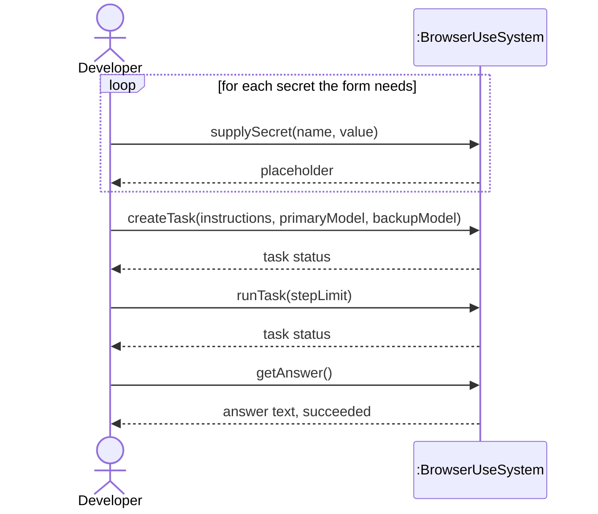
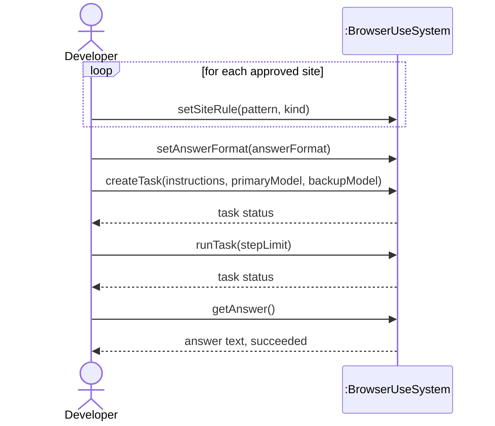

# System Sequence Diagrams

One SSD per fully-dressed use case. The system is a single black box; the only actor is the
Developer. Event names and parameters use the terms in `docs/domain-model.md`.

## SSD 1: Look Up Information Online

## SSD 2: Submit Web Form

## SSD 3: Collect Data From Website

