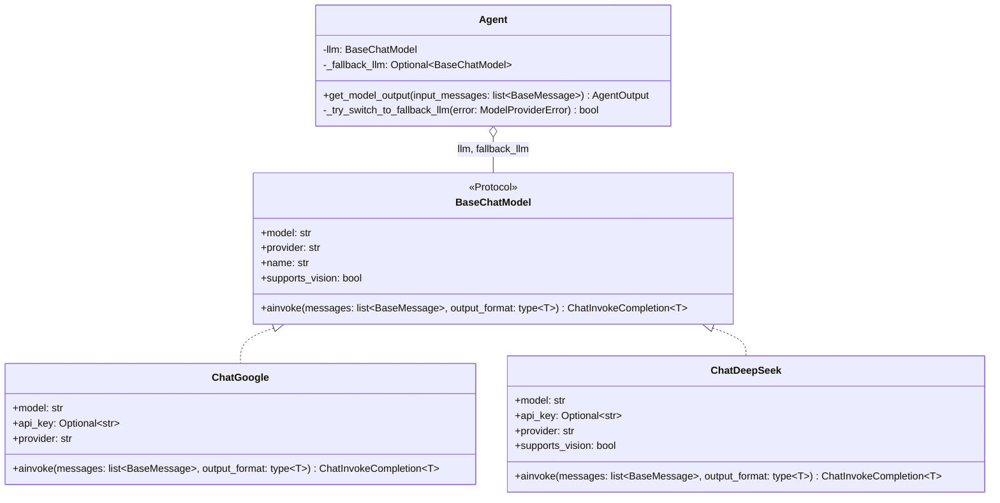
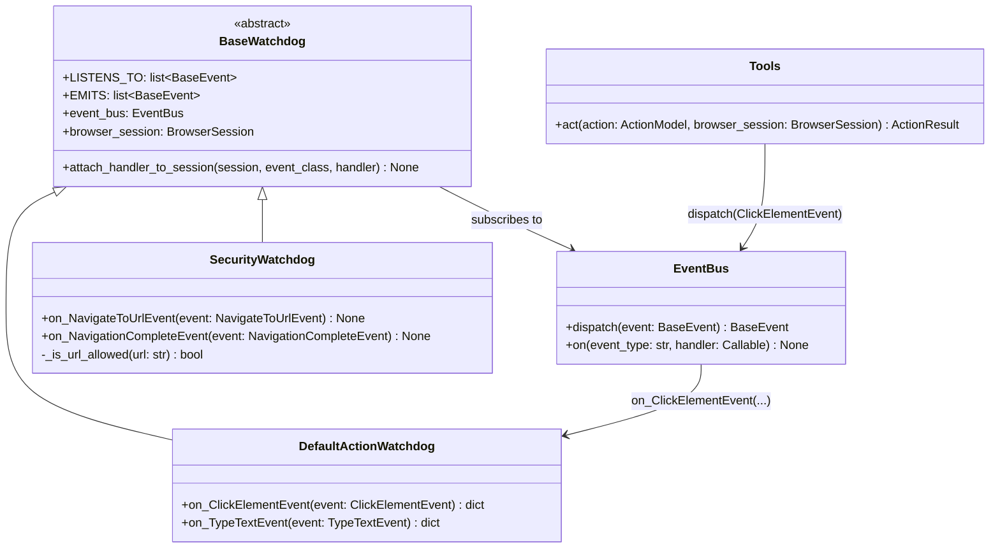
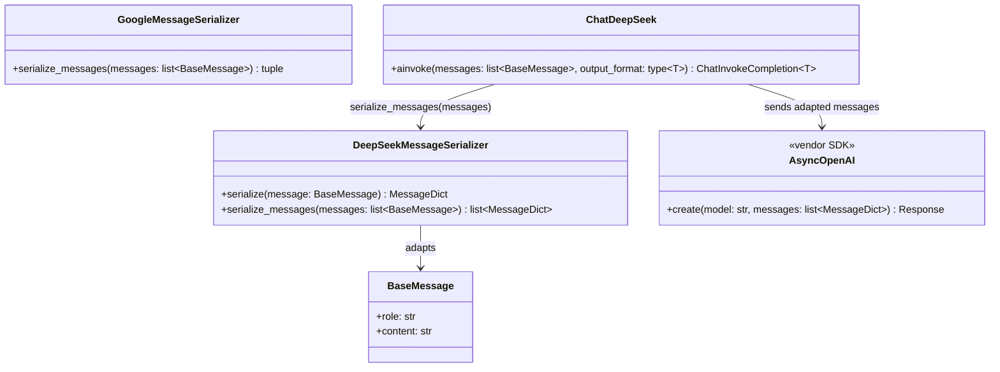

# Design Patterns

Patterns found in browser-use, one pattern added, and one GRASP refactoring. The two code changes
are separate commits on my fork:

- `A8: Apply Factory Method to get_llm_by_name` — `479072db`
- `A8-GRASP: Refactor Agent to apply Information Expert` — `657057c6`

Diagram sources: `docs/design-patterns.md`.

## Part 1: Three GoF Patterns Already in the Codebase

### 1. Strategy — swappable AI models

| Role | Class | Where |
|---|---|---|
| Strategy | `BaseChatModel` | `browser_use/llm/base.py:33` |
| Concrete strategies | `ChatGoogle`, `ChatDeepSeek`, `ChatOpenAI`, and 11 more | `browser_use/llm/google/chat.py:49`, `deepseek/chat.py:30`, ... |
| Context | `Agent`, holding `llm` and `_fallback_llm` | `browser_use/agent/service.py:375, 379` |



```python
# browser_use/llm/base.py:33
class BaseChatModel(Protocol):
    model: str

    @property
    def provider(self) -> str: ...

    async def ainvoke(self, messages: list[BaseMessage], output_format: type[T], **kwargs) -> ChatInvokeCompletion[T]: ...
```

**What it solves here.** The project has to work with fourteen vendors whose APIs agree on nothing:
different authentication, different message shapes, different error codes. `Agent` calls
`self.llm.ainvoke(...)` and never learns which one answered. Without it, every vendor difference
would surface as a branch inside the agent loop, and the `fallback_llm` feature would be impossible,
since switching models mid-run is just assigning a different strategy to the same field.

### 2. Observer — the event bus and the watchdogs

| Role | Class | Where |
|---|---|---|
| Subject | `EventBus`, owned by `BrowserSession` | `bubus` package; `browser_use/browser/session.py` |
| Observer base | `BaseWatchdog` | `browser_use/browser/watchdog_base.py:33-38` |
| Concrete observers | `SecurityWatchdog`, `DefaultActionWatchdog`, `DOMWatchdog`, 12 more | `browser_use/browser/watchdogs/` |
| Notification | `ClickElementEvent`, `NavigateToUrlEvent`, ... | `browser_use/browser/events.py` |



```python
# browser_use/tools/service.py:731
event = browser_session.event_bus.dispatch(ClickElementEvent(node=node))
click_metadata = await event.event_result(raise_if_any=True, raise_if_none=False)

# browser_use/browser/watchdogs/default_action_watchdog.py:337
async def on_ClickElementEvent(self, event: ClickElementEvent) -> dict | None:
    """Handle click request with CDP. Automatically waits for file downloads if triggered."""
```

**What it solves here.** Fifteen separate concerns need to react to the same browser activity:
security checks, downloads, crash recovery, screenshots, popups, CAPTCHAs. Without the bus, every
one of those would be a call inside `BrowserSession`, and that class would grow a branch per
concern. Instead a watchdog is a file that declares which events it handles, and `session.py` only
has to attach it. Adding behavior means adding a subscriber, not editing a dispatcher.

### 3. Adapter — per-provider message serializers

| Role | Class | Where |
|---|---|---|
| Target | the message format each vendor SDK requires | vendor SDKs |
| Adaptee | browser-use's own `BaseMessage`, `UserMessage`, `SystemMessage` | `browser_use/llm/messages.py` |
| Adapters | `DeepSeekMessageSerializer`, `GoogleMessageSerializer`, `AnthropicMessageSerializer`, and one per provider | `browser_use/llm/*/serializer.py` |
| Client | `ChatDeepSeek.ainvoke` | `browser_use/llm/deepseek/chat.py:135` |



```python
# browser_use/llm/deepseek/serializer.py:108
@staticmethod
def serialize_messages(messages: list[BaseMessage]) -> list[MessageDict]:
    ...

# browser_use/llm/deepseek/chat.py:135
ds_messages = DeepSeekMessageSerializer.serialize_messages(messages)
```

**What it solves here.** The agent builds one list of messages, but Google expects `Content` objects
with a separate system instruction, OpenAI-compatible APIs expect dictionaries with a `role` key,
and Anthropic expects its own shape again. Each adapter translates the one internal format into one
vendor format, so the conversion lives next to the provider that needs it. Without it, either the
agent would build messages differently per vendor, or every `Chat*` class would carry its
translation inline, and the Strategy above would leak vendor detail back into the caller.

## Part 2: A Pattern That Is Missing

**Where:** `get_llm_by_name()` in `browser_use/llm/models.py`, the function that turns a string like
`google_gemini_2_5_flash` into a model object.

**The problem it caused.** The provider half of that function was an eight-branch `if/elif` chain on
a string, with each branch hard-coding a class and its environment variable. The list of valid
providers was then repeated by hand in the error message. Two consequences were visible in the code:
the function had to be edited for every new provider, and it had fallen behind, since
`browser_use/llm/` ships fourteen provider packages while only eight were reachable by name.
DeepSeek, Groq, OpenRouter, Ollama, Vercel and others could be imported directly but never resolved
from a model string.

**The pattern that fixes it: Factory Method**, in its registry form. Each provider gets a small
creator function, and a dictionary maps the provider name to it. `get_llm_by_name` looks up the
creator instead of testing for each provider in turn, and the error message is generated from the
registry's own keys, so it cannot drift out of date.

**GRASP connection.** The conditional violated **Protected Variations**: the point of variation is
"which provider," and every new one forced a change in a function that should have been stable. It
also hurt **Low Coupling**, since one function knew the constructor and environment variable of
every provider. The registry restores Protected Variations, because the variation sits behind a
lookup, and moves creation knowledge to a per-provider creator function, which is **Creator**
applied properly.

## Part 3: The Implementation

Commit `479072db`, message `A8: Apply Factory Method to get_llm_by_name`.

**Before:**

```python
# browser_use/llm/models.py, before
if provider == 'openai':
    api_key = os.getenv('OPENAI_API_KEY')
    return ChatOpenAI(model=model, api_key=api_key)
elif provider == 'azure':
    api_key = os.getenv('AZURE_OPENAI_KEY') or os.getenv('AZURE_OPENAI_API_KEY')
    azure_endpoint = os.getenv('AZURE_OPENAI_ENDPOINT')
    return ChatAzureOpenAI(model=model, api_key=api_key, azure_endpoint=azure_endpoint)
# ... six more branches ...
else:
    available_providers = ['openai', 'azure', 'google', 'anthropic', 'mistral', 'oci', 'cerebras', 'bu']
    raise ValueError(f"Unknown provider: '{provider}'. Available providers: {', '.join(available_providers)}")
```

**After:**

```python
# browser_use/llm/models.py:90
def _create_openai(model: str, model_part: str) -> 'BaseChatModel':
    return ChatOpenAI(model=model, api_key=os.getenv('OPENAI_API_KEY'))


# browser_use/llm/models.py:144
# Adding a provider means adding one entry here, not editing get_llm_by_name().
_PROVIDER_FACTORIES: dict[str, Callable[[str, str], 'BaseChatModel']] = {
    'openai': _create_openai,
    'azure': _create_azure,
    'google': _create_google,
    'anthropic': _create_anthropic,
    'mistral': _create_mistral,
    'oci': _create_oci,
    'cerebras': _create_cerebras,
    'bu': _create_browser_use,
    'deepseek': _create_deepseek,
}


# browser_use/llm/models.py:235
create = _PROVIDER_FACTORIES.get(provider)
if create is None:
    raise ValueError(f"Unknown provider: '{provider}'. Available providers: {', '.join(_PROVIDER_FACTORIES)}")

return create(model, model_part)
```

**What is now easier to change.** Adding a provider is one function plus one dictionary entry, and
`get_llm_by_name` itself never changes. I proved that by adding DeepSeek in the same commit as a
single entry, so `get_llm_by_name('deepseek_deepseek-chat')` now works where it previously raised
`Unknown provider`. The error message also lists providers straight from the registry, so it can no
longer disagree with what the function actually supports.

**Checks:** the four existing tests in `tests/ci/models/test_llm_model_factory.py` pass unchanged,
100 tests in `tests/ci/models` pass, and `ruff check` and `ruff format` are clean.

## Part 4: The GRASP Refactoring

Commit `657057c6`, message `A8-GRASP: Refactor Agent to apply Information Expert`.

**What moved and why.** Whether a model can be sent screenshots is a fact about the model, but
`Agent.__init__` was working it out by substring-matching the model's name, with the project's own
`# TODO: move this logic to the LLMs` sitting directly above it. I moved that knowledge into the
model layer: `BaseChatModel.supports_vision` holds the default, `ChatDeepSeek` overrides it to
`False`, and the agent now asks instead of guessing. The new arrangement is better because the class
that owns the data also answers questions about it, so a provider can state its own capability
rather than hoping the agent's string matching gets it right.

**Before:**

```python
# browser_use/agent/service.py, before
# TODO: move this logic to the LLMs
if 'deepseek' in self.llm.model.lower():
    self.logger.warning('DeepSeek models do not support use_vision=True yet. Setting use_vision=False for now...')
    self.settings.use_vision = False

model_lower = self.llm.model.lower()
if 'grok-3' in model_lower or 'grok-code' in model_lower:
    self.logger.warning('This XAI model does not support use_vision=True yet. Setting use_vision=False for now...')
    self.settings.use_vision = False
```

**After:**

```python
# browser_use/llm/base.py:50
@property
def supports_vision(self) -> bool:
    """Whether this model can be sent screenshots. ..."""
    name = self.model.lower()
    return not ('grok-3' in name or 'grok-code' in name)


# browser_use/llm/deepseek/chat.py:54
@property
def supports_vision(self) -> bool:
    # DeepSeek's chat models are text only, so screenshots cannot be sent to them.
    return False


# browser_use/agent/service.py:475
if self.settings.use_vision and not self.llm.supports_vision:
    self.logger.warning(f'{self.llm.name} does not support use_vision=True. Setting use_vision=False for now...')
    self.settings.use_vision = False
```

**Behavior is unchanged**, checked case by case:

| Model | supports_vision |
|---|---|
| `deepseek-v4-flash` | False |
| `grok-3-mini`, `grok-code-fast` | False |
| `grok-4` | True |
| `gemini-3.5-flash-lite`, `gpt-5.5` | True |

**Checks:** 100 tests pass in `tests/ci/models`, 10 vision-related tests pass across `tests/ci`, and
lint is clean. Twelve lines in `Agent` became four.

## Part 5: GoF and GRASP

GRASP principles answer "who should be responsible for this?", while GoF patterns are named
structures for recurring design problems, so in practice GRASP tells you something is in the wrong
place and GoF gives you the shape to move it into. Both of my changes started as GRASP judgements.
The vision check was an Information Expert problem: the agent was answering a question about data it
did not own, and the fix needed no pattern at all, just moving the property onto the class that owns
the model name. The provider conditional was a Protected Variations problem: the thing that varies,
"which provider," was wired into a function that had to change every time a provider appeared, and
there the fix did have a name, Factory Method in its registry form. The difference between the two is
the useful lesson: GRASP is the diagnosis, and a GoF pattern is sometimes, but not always, the
prescription.
