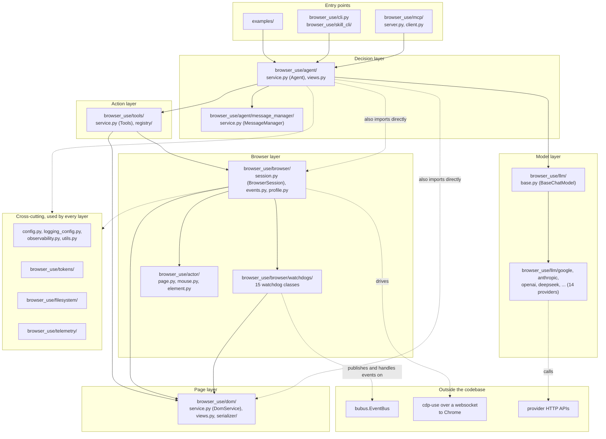
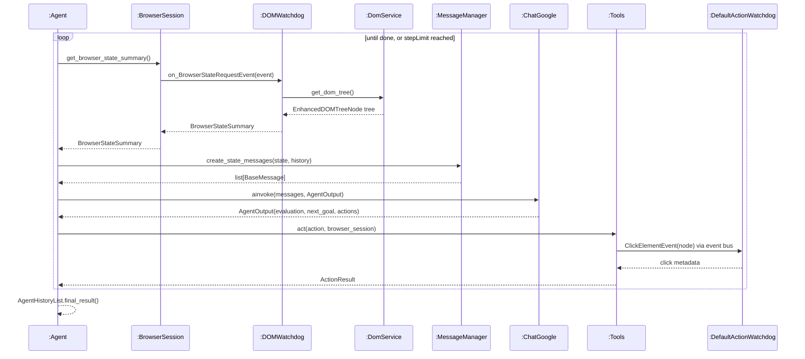
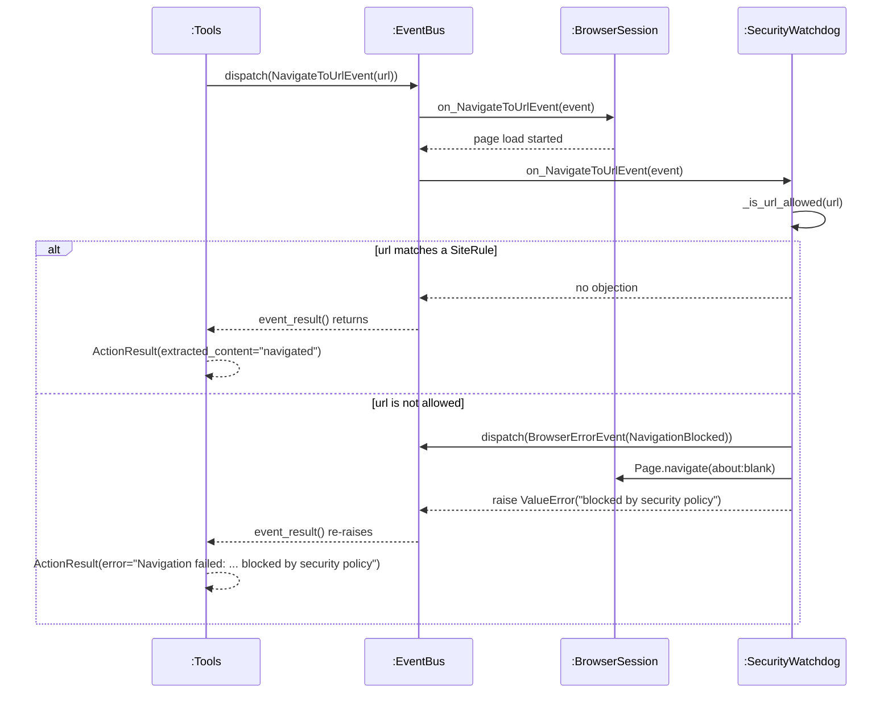

# Logical Architecture

Architecture of browser-use, read from the code at commit `f1aa3e97`. Diagram sources live in
`docs/architecture.md` and `docs/interaction-diagrams.md`.

## Part 1: Architectural Style

browser-use is a hybrid: **layered at the package level, event-driven inside the browser layer, and
client-server at its two outer boundaries**. The top-level `browser_use/` directory has no
`controllers/`, `views/`, `routes/` or `repositories/`, so it isn't MVC or a repository-style
layout. It is split by capability instead: `agent/` decides, `tools/` carries decisions out,
`browser/` runs the browser, `dom/` reads the page, and `llm/` talks to AI providers. Counting
`from browser_use.<package>` imports shows the dependency direction is consistently downward:
`agent` imports `llm` 15 times, `browser` 8, `dom` 5 and `tools` 3; `tools` imports `browser` 7
times and `dom` 4; `browser` imports `dom` 9 times. The arrows that appear to point back up are not
real: `dom/service.py:29` and `actor/page.py` import `BrowserSession` only inside
`if TYPE_CHECKING:`, and the only `llm` to `agent` imports are in `browser_use/llm/tests/`. Inside
the browser layer the style changes to event-driven: `BrowserSession` owns a `bubus.EventBus`,
`Tools` dispatches a `ClickElementEvent` without naming a handler (`tools/service.py:731`), and 15
watchdog classes in `browser/watchdogs/` subscribe by method name, such as
`DefaultActionWatchdog.on_ClickElementEvent` (`default_action_watchdog.py:337`). At the edges it is
client-server twice over: `cdp-use` sends JSON-RPC over a websocket to a separate Chrome process,
and each provider package under `llm/` calls a vendor's HTTP API. The layering is a convention
rather than something enforced: there are no port or interface packages between layers, and one
genuine cycle exists between `BrowserSession` and the watchdogs, documented in Part 4.

## Part 2: Logical Architecture Diagram

Source: `docs/architecture.md`. Arrows point from the importing package to the imported one.
Dashed arrows are either direct imports that skip a layer, or calls out of the codebase.



## Part 3: Interaction Diagrams

### 3.1 Inside `runTask(stepLimit)` — one agent step

This expands the `runTask(stepLimit)` system event from SSD 2 on the
[SSDs and Operation Contracts](SSDs-and-Operation-Contracts) page. There the system was one box.
Participants: `Agent` (`agent/service.py:2503`), `BrowserSession` (`browser/session.py:1595`),
`DOMWatchdog` (`browser/watchdogs/dom_watchdog.py:244`), `DomService` (`dom/service.py:703`),
`MessageManager` (`agent/message_manager/service.py:424`), `ChatGoogle` (`llm/google/chat.py`),
`Tools` (`tools/service.py:2178`), `DefaultActionWatchdog` (`default_action_watchdog.py:337`).



### 3.2 Inside the `navigate(url)` action — the security check

A different operation: opening a page, and what happens when the site is not on the approved list.
Participants: `Tools` (`tools/service.py:507`), `EventBus` (bubus), `BrowserSession`
(`browser/session.py:905`), `SecurityWatchdog` (`browser/watchdogs/security_watchdog.py:35`).



`BrowserSession.on_NavigateToUrlEvent` runs before `SecurityWatchdog.on_NavigateToUrlEvent`, so the
page starts loading before the check runs. I confirmed this with `allowed_domains=['example.com']`:
the tab was switched to `about:blank` afterwards, and the blocked site still received the request.

## Part 4: One Architectural Concern

**A circular dependency between `BrowserSession` and the watchdogs, hidden by deferred imports.**

`browser_use/browser/watchdog_base.py` imports the session at module level, so every watchdog class
depends on `BrowserSession`:

```python
# browser_use/browser/watchdog_base.py:12
from browser_use.browser.session import BrowserSession
```

The session depends on the watchdogs right back, but it cannot say so at the top of the file
without a circular import at load time, so all 15 imports sit inside a method body:

```python
# browser_use/browser/session.py:1688
async def attach_all_watchdogs(self) -> None:
    """Initialize and attach all watchdogs with explicit handler registration."""
    ...
    from browser_use.browser.watchdogs.aboutblank_watchdog import AboutBlankWatchdog
    from browser_use.browser.watchdogs.captcha_watchdog import CaptchaWatchdog
    ...
```

What it costs: the real dependency structure can no longer be read from the imports at the top of
`session.py`, so both a human and any static analysis tool see a false picture of the browser layer.
Neither side can be used without the other, since the base class for every watchdog pulls in the
whole session module, which is why a watchdog test has to construct a `BrowserSession`. And the
direction is backwards from the design intent: watchdogs are meant to observe the session through
events, yet the base class has a compile-time dependency on the thing it observes.

## Part 5: GRASP in Your Project

### Applied well 1: Polymorphism and Protected Variations — `BaseChatModel`

```python
# browser_use/llm/base.py:33
class BaseChatModel(Protocol):
    model: str

    @property
    def provider(self) -> str: ...

    async def ainvoke(self, messages: list[BaseMessage], output_format: type[T], **kwargs) -> ChatInvokeCompletion[T]: ...
```

Fourteen provider packages under `browser_use/llm/` implement this one interface, and the `Agent`
calls `self.llm.ainvoke(...)` without ever branching on which provider answered. The variation
point, "which company's API are we talking to," is wrapped behind a stable interface, so adding
OrcaRouter in PR #5451 meant adding a folder and changing nothing in `agent/`. I exercised this
myself by switching providers three times while getting the project running.

### Applied well 2: Indirection and Low Coupling — the event bus between `Tools` and the watchdogs

```python
# browser_use/tools/service.py:731
event = browser_session.event_bus.dispatch(ClickElementEvent(node=node))
click_metadata = await event.event_result(raise_if_any=True, raise_if_none=False)
```

```python
# browser_use/browser/watchdogs/default_action_watchdog.py:337
async def on_ClickElementEvent(self, event: ClickElementEvent) -> dict | None:
    """Handle click request with CDP. Automatically waits for file downloads if triggered."""
```

The action layer never names the class that performs the click; the bus sits between them and pairs
them by the event's name. That is Indirection creating Low Coupling, and the benefit is real: a new
subscriber to `ClickElementEvent`, such as click logging, can be added without editing either file.

### Violated: Information Expert — the `Agent` decides what a model can do

```python
# browser_use/agent/service.py:474
# TODO: move this logic to the LLMs
# Handle users trying to use use_vision=True with DeepSeek models
if 'deepseek' in self.llm.model.lower():
    self.logger.warning('DeepSeek models do not support use_vision=True yet. Setting use_vision=False for now...')
    self.settings.use_vision = False
```

Whether a model can read screenshots is a fact about the model, so the model class should hold it.
Instead the `Agent` substring-matches the model's name, and the project's own comment on line 474
says this belongs in the LLMs. The consequences are concrete: every new text-only model requires an
edit to `Agent`, a model missing from the list is sent screenshots it cannot use, and the match is
wrong in the other direction too, since a future DeepSeek model that can see images would still have
screenshots switched off because its name contains "deepseek". My domain model already treats this
as a property of the model, `AIModel.canSeeScreenshots`, which is where the code should put it.
