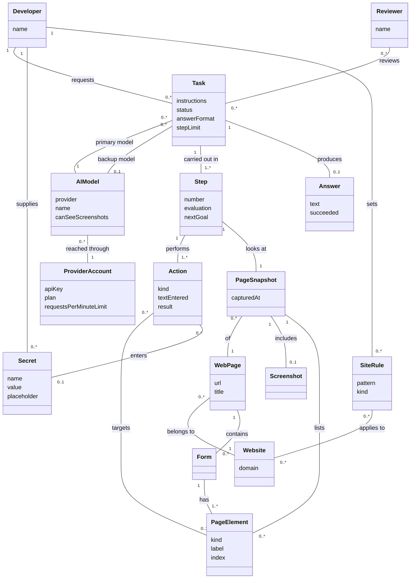
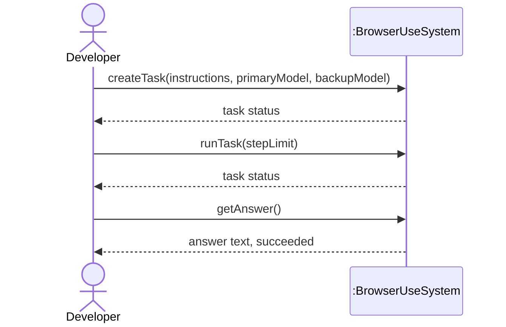
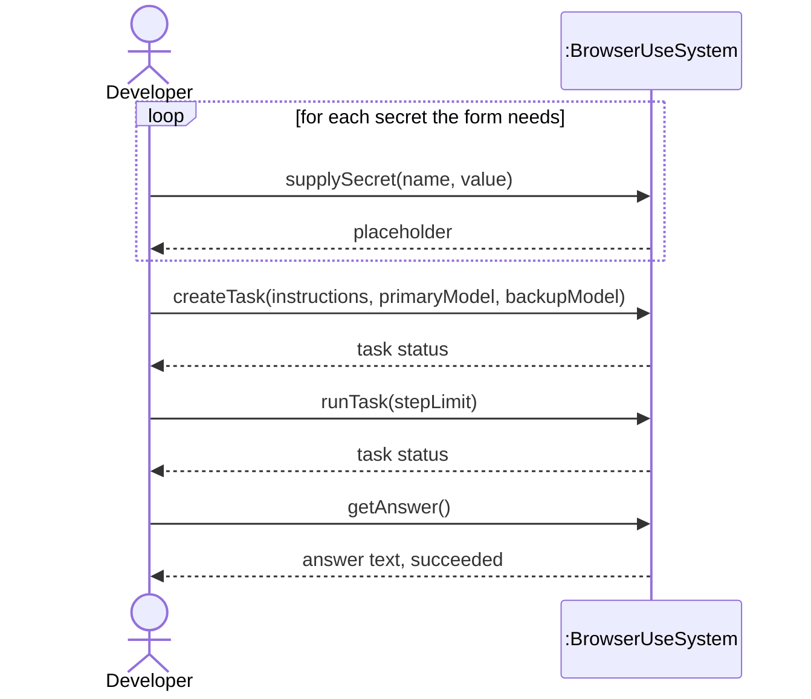
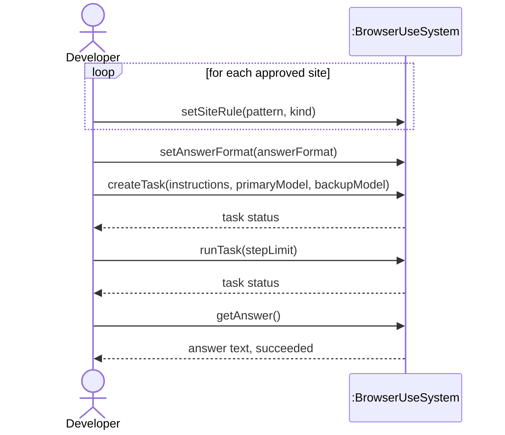

# SSDs and Operation Contracts

Domain model, system sequence diagrams and operation contracts for browser-use, built from the three
fully-dressed use cases on the [Requirements and Use Cases](Requirements-and-Use-Cases) page.
Sources in the repository: `docs/domain-model.md`, `docs/ssds.md`, `docs/contracts.md`.

## Part 1: Tighten the Domain Model

### Noun analysis

| Noun phrase | Found in | Decision | Why |
|---|---|---|---|
| developer | Look Up Information Online, step 1 | Conceptual class: `Developer` | A real person with an identity |
| script | Look Up, step 1 | Neither | Software the developer writes, not a domain concept |
| agent / "the system" | Look Up, step 2 | Neither | This is the system being designed; a domain model doesn't include itself |
| question in plain English | Look Up, step 1 | Conceptual class: `Task` | The job being handed over; it has a status, steps and an answer |
| instructions | Submit Web Form, step 1 | Attribute of `Task` | Just the wording of the task |
| AI model | Look Up, step 4 | Conceptual class: `AIModel` | A named thing that can be swapped for another and has its own abilities |
| model provider (Google Gemini) | Look Up, stakeholders | Attribute of `AIModel`: provider | A name |
| the account (its rate limits and quota) | Look Up, stakeholders | Conceptual class: `ProviderAccount` | The thing the key and the limits belong to; extensions 5a and 5b are about it |
| API key | Look Up, preconditions | Attribute of `ProviderAccount`: apiKey | Text |
| rate limit / quota | Look Up, stakeholders | Attribute of `ProviderAccount`: requestsPerMinuteLimit | A number |
| backup model | Look Up, 5a | Neither | An `AIModel` playing a role; it shows as a role name on the association |
| Chrome / browser | Look Up, step 2 | Neither | The program the system drives; what matters here is the page it shows |
| tab | Collect Data, 2a | Neither | Part of the browser program; which page is showing is covered by `PageSnapshot` |
| page | Look Up, step 3 | Conceptual class: `WebPage` | A real thing with an address and a title |
| URL | Submit, step 2 | Attribute of `WebPage`: url | Text |
| site / website | Collect Data, preconditions | Conceptual class: `Website` | Pages belong to it, and site rules are written against it |
| "captures the current page" | Look Up, step 3 | Conceptual class: `PageSnapshot` | What the model is actually shown at one step, which is not the live page |
| screenshot | Look Up, step 3; Submit, 1a and 3a | Conceptual class: `Screenshot` | A picture, not text or a number, and it can carry things the page text doesn't |
| element / numbered list of elements | Look Up, step 3 | Conceptual class: `PageElement` | A real thing on the page that can be clicked or typed into |
| the number on an element | Submit, step 3 | Attribute of `PageElement`: index | A number |
| field / button | Submit, steps 3-6 | Attribute of `PageElement`: kind | A kind of element, not a separate thing |
| form / contact form | Submit, step 1 | Conceptual class: `Form` | A real grouping of fields that gets submitted as one |
| value for a field | Submit, step 1 | Attribute of `Action`: textEntered | Text |
| password / secret | Submit, 1a | Conceptual class: `Secret` | It has a name, is referred to by that name, and is supplied separately from the task |
| placeholder `<secret>name</secret>` | Submit, 1a | Attribute of `Secret`: placeholder | Text that stands in for the value |
| step | Look Up, step 7 | Conceptual class: `Step` | One round of look, decide and act, with its own record |
| evaluation / memory note / next goal | Look Up, step 5 | Attributes of `Step` | All three are text |
| action (input, click, navigate, done, extract) | Look Up, steps 5-6 | Conceptual class: `Action` | A real thing done to the browser; the individual names are values of its kind |
| error ("blocked by security policy") | Collect Data, 2a | Attribute of `Action`: result | Text describing how the action ended |
| answer / final result | Look Up, step 9 | Conceptual class: `Answer` | What the developer receives; it may or may not exist |
| success | Look Up, 7b | Attribute of `Answer`: succeeded | True or false |
| response page | Submit, step 7 | Neither | It is a `WebPage`, already in the model |
| history / record of the run | Look Up, success guarantee | Neither | The record is the `Task` with its `Step`s and `Answer` |
| reviewer | Submit, stakeholders | Conceptual class: `Reviewer` | A real person who reads the record afterward |
| approved sites / allowed_domains | Collect Data, preconditions | Conceptual class: `SiteRule` | A rule saying which sites may be visited |
| pattern | Collect Data, 2a | Attribute of `SiteRule`: pattern | Text |
| step limit | Look Up, 7b | Attribute of `Task`: stepLimit | A number |
| requested format / schema | Collect Data, step 1 and 1a | Attribute of `Task`: answerFormat | A description of how the answer should look |
| CAPTCHA | Look Up, 6a | Neither | A page the site shows, so a `WebPage` |
| search engine | Look Up, 6a | Neither | A `Website` |
| Markdown text, characters, batch | Collect Data, 4a | Neither | How extraction is carried out inside the system |
| quotes, authors, tags | Collect Data, step 1 | Neither | The contents of one particular answer |

### Updated domain model



### What changed, and why

The model went from 8 classes to 16, and every addition came from a noun the use cases actually use. The biggest change is that "the page" split into three: `WebPage` is the live page with its address, `Website` is the site it belongs to (so `SiteRule` has something to apply to), and `PageSnapshot` is what the model is shown at one step. My verification runs forced that split. The captured text and the `Screenshot` carry different information, since the page text showed `<secret>customer_email</secret>` while the screenshot showed the real address, so a screenshot has to be its own class rather than a detail of the page. `Secret`, `ProviderAccount`, `Form`, `SiteRule` and `Reviewer` come from the preconditions and stakeholder lists I had written but never modeled, and `Task` picked up `stepLimit` and `answerFormat` from extensions 7b and 1a. `User` became `Developer` to match the primary actor in all three use cases. I left out the agent itself, Chrome, tabs and the run history: the first is the system being designed, the next two are the software it drives, and the history is just the `Task` with its steps and answer.

## Part 2: System Sequence Diagrams

The system is one black box in every diagram, the Developer is the only actor, and every event is named
as an operation with parameters taken from the domain model.

### SSD 1: Look Up Information Online



### SSD 2: Submit Web Form



### SSD 3: Collect Data From Website



## Part 3: Operation Contracts

```text
Operation: createTask(instructions: Text, primaryModel: AIModel, backupModel: AIModel)
Cross-references: Use case Look Up Information Online
Preconditions:
  - A Developer exists
  - An AIModel exists to act as the primary model, reached through a ProviderAccount
    whose apiKey is set
Postconditions:
  - A Task instance was created
  - Task.instructions was set to instructions
  - Task.status was set to notStarted
  - Task.answerFormat was set to plain text
  - The Task was associated with the Developer
  - The Task was associated with the primaryModel AIModel as primary model
  - The Task was associated with the backupModel AIModel as backup model
```

```text
Operation: runTask(stepLimit: Number)
Cross-references: Use case Submit Web Form
Preconditions:
  - A Task exists with Task.status notStarted, associated with a Developer and with an
    AIModel as primary model
  - Every Secret named by a placeholder in Task.instructions exists and is associated
    with that Developer
Postconditions:
  - Task.stepLimit was set to stepLimit
  - Task.status was set to finished
  - Step instances were created
  - Each Step was associated with the Task
  - Step.number was set to its position in the run
  - Step.evaluation was set to the model's judgement of the previous step
  - Step.nextGoal was set to the model's stated goal for that step
  - A PageSnapshot instance was created for each Step
  - Each PageSnapshot was associated with its Step
  - Each PageSnapshot was associated with the WebPage it was taken from
  - A Screenshot instance was created and associated with each PageSnapshot
  - PageElement instances were created and associated with their PageSnapshot
  - Action instances were created and associated with their Step
  - Action.kind was set to input for each field filled, and to click for the option
    choices and the Submit button
  - Action.textEntered was set to the value typed for each input Action
  - Action.result was set to the outcome reported for that Action
  - Each input Action was associated with the PageElement it targeted
  - Each input Action that typed a secret was associated with that Secret
  - An Answer instance was created
  - Answer.text was set to the response the Website returned
  - Answer.succeeded was set to true
  - The Answer was associated with the Task
```

```text
Operation: setSiteRule(pattern: Text, kind: Text)
Cross-references: Use case Collect Data From Website
Preconditions:
  - A Developer exists
  - No SiteRule with this pattern and kind is already associated with that Developer
Postconditions:
  - A SiteRule instance was created
  - SiteRule.pattern was set to pattern
  - SiteRule.kind was set to kind, either allowed or prohibited
  - The SiteRule was associated with the Developer
  - The SiteRule was associated with each Website whose domain matches pattern
```

## Consistency check

| SSD event | Comes from this use case step | Contract |
|---|---|---|
| `createTask(instructions, primaryModel, backupModel)` | Look Up step 1: creates an Agent with a question and a model | Contract 1 |
| `runTask(stepLimit)` | Look Up step 1 (`run()`), its steps 3-8, and 7b for the limit | Contract 2 |
| `getAnswer()` | Look Up step 9: the script prints `final_result()` | - |
| `supplySecret(name, value)` | Submit Web Form 1a: the value goes in `sensitive_data`, not in the task text | - |
| `setSiteRule(pattern, kind)` | Collect Data preconditions: the site must be on the approved list | Contract 3 |
| `setAnswerFormat(answerFormat)` | Collect Data 1a: the developer supplies a schema | - |
