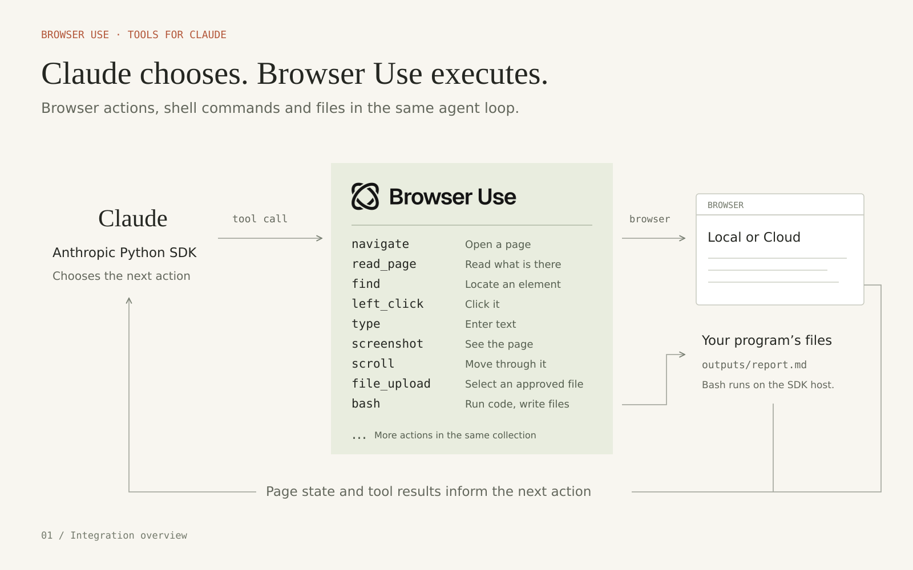
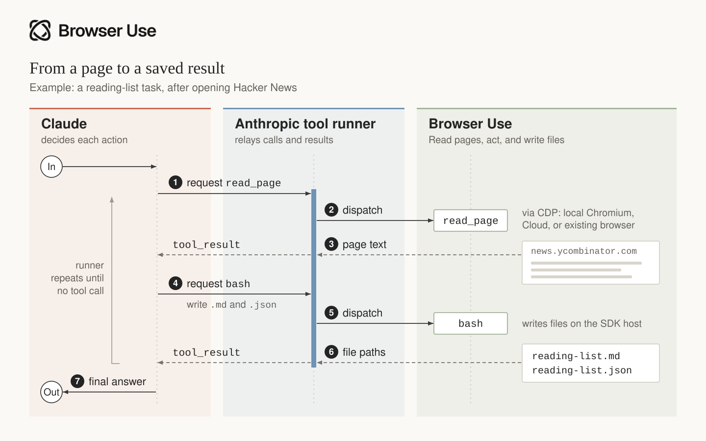
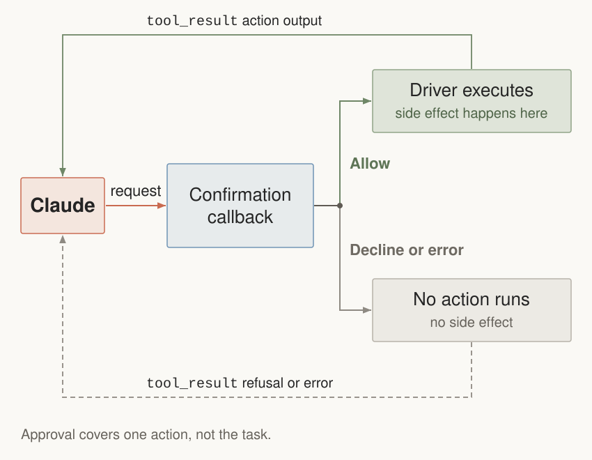

# Browser Use toolsets for Claude

Browser Use toolsets for Claude is maintained by Browser Use and is compatible with Claude. It provides browser actions and a Bash tool through the Anthropic Python SDK. The SDK's tool runner sends each of Claude's tool calls to Browser Use, returns the result to Claude, and repeats until Claude finishes.



The same program works with three browser runtimes:

| Runtime | Driver | Who starts and stops it? |
| --- | --- | --- |
| Local Chromium | `BrowserUse()` | The driver |
| Browser Use Cloud | `BrowserUse(use_cloud=True)` | The driver |
| Existing local or remote CDP browser | `BrowserUse(session)` | Your application |

## Quickstart

This example requires Python 3.11 or newer and Linux or macOS with `/bin/bash`.
On Windows, run it inside WSL. Anthropic's browser toolset requires
the Anthropic SDK release that includes `anthropic.tools.browser` and
`client.beta.messages.tool_runner`.

Create a project and install both packages. The Chromium installation is only needed for a local browser:

```bash
uv init --python 3.12
uv add "browser-use>=0.13.11" "anthropic>=1,<2"
uvx browser-use install
```

Create an Anthropic API key in the [Claude Console](https://platform.claude.com/settings/keys), then export it in the terminal where you run the script. This key is required for every browser mode:

```bash
export ANTHROPIC_API_KEY=your-key
# Optional: show Anthropic SDK logs
export ANTHROPIC_LOG=info
```


Before running the example, check that the installed SDK exposes the browser toolset:

```bash
uv run python -c "from anthropic.tools.browser import LocalFilePolicy; from browser_use.integrations.toolsets_for_claude import Bash, BrowserUse; print('Browser toolset imports OK')"
```

Browser Use 0.13.11 or newer includes this integration. The Anthropic 1.x version range alone does not guarantee browser-toolset support: you need the compatible release from Anthropic. If the check reports that `anthropic.tools.browser` is missing, follow Anthropic's browser-toolset release instructions before continuing. Reinstalling Browser Use or adding a Cloud key cannot supply that SDK module.

A local browser only needs `ANTHROPIC_API_KEY`; it does not require a Browser Use Cloud key. Keep both keys exported when using Cloud: Anthropic runs Claude, while Browser Use provisions the browser. The shell `export` commands above apply to the current terminal; this script does not load a `.env` file automatically.

The quickstart reads three Hacker News posts and saves their titles and URLs as Markdown and JSON. It enables all 31 browser actions plus Bash, without approval prompts.

Save this as `run_browser.py`:

```python
"""Build a Hacker News reading list with Browser Use and Claude.

Requires Linux/macOS with /bin/bash, or WSL on Windows.
"""

import asyncio
from pathlib import Path

from anthropic import AsyncAnthropic
from anthropic.tools.browser import LocalFilePolicy  # pyright: ignore[reportMissingImports]

from browser_use.integrations.toolsets_for_claude import Bash, BrowserUse

TASK = 'Read the first three Hacker News posts and save their titles and URLs to hacker-news.md and hacker-news.json.'

SYSTEM_PROMPT = 'Complete the task with the browser tools and Bash.'


async def main() -> None:
	driver = BrowserUse(
		# use_cloud=True,  # Uncomment and set BROWSER_USE_API_KEY to use Cloud.
		# These tools are disabled by default.
		configs={
			'javascript_exec': {'enabled': True},
			'file_upload': {'enabled': True},
			'read_console': {'enabled': True},
			'read_network': {'enabled': True},
		},
		confirm=lambda _: True,  # Run without approval prompts.
		file_policy=LocalFilePolicy(upload_roots=[Path('uploads'), Path('outputs')]),
	)
	bash = Bash(output_dir=Path('outputs'))

	async with driver, AsyncAnthropic() as client:
		runner = client.beta.messages.tool_runner(
			model='claude-opus-5-5',
			max_tokens=32_768,
			max_iterations=100,
			tools=[driver, bash],
			system=SYSTEM_PROMPT,
			messages=[{'role': 'user', 'content': TASK}],
		)
		final = await runner.until_done()
		print('\n'.join(block.text for block in final.content if block.type == 'text'))


if __name__ == '__main__':
	asyncio.run(main())
```

Run it:

```bash
uv run run_browser.py
```

### What the run looks like


This is a retained capture of the earlier `example.com` smoke, not the Hacker News
task above. The model loop wrote `title.txt`, captured the remote browser, and
stopped the owned Cloud session when the context exited.

The Hacker News example saves three posts as Markdown and JSON. Bash writes both files to `outputs/`.

### Prompt and execution model

The `SYSTEM_PROMPT` above is application guidance you can adapt. Anthropic supplies
the tool schemas and runner; this integration does not install a hidden agent prompt.
`BrowserUse` exposes structured browser actions, not a default CDP code interpreter.
CDP is the connection used underneath. `javascript_exec` evaluates JavaScript
inside the page; it cannot import host libraries or execute arbitrary CDP commands.
`Bash` comes from the same Browser Use integration and runs on the SDK host.
Register both with `tools=[driver, bash]`. Browser approval callbacks do not cover Bash.

The `async with driver` block closes browsers that the driver launches. When
you pass an existing session, your application keeps responsibility for closing it.

See Anthropic's
[browser-toolset quickstarts](https://github.com/anthropics/claude-quickstarts/tree/main/browser-toolset)
for the SDK concepts and runner behavior.

## Browser tools

After opening Hacker News, Claude can call `read_page` to inspect the page,
then call `bash` to write the reading list. Anthropic's runner passes each
call to Browser Use and returns the result to Claude. Browser actions and
Bash are part of the same integration; they run on the browser host and
SDK host respectively.



## Browser Use Cloud

Keep `ANTHROPIC_API_KEY` set and also export your Cloud key:

```bash
export BROWSER_USE_API_KEY=your-cloud-key
```

Then uncomment `use_cloud=True` in the existing `BrowserUse(...)` call. Keep its `configs` and `confirm` arguments to preserve the quickstart tool selection and approvals. For remote uploads, replace the local `file_policy` with the staged-document policy and resolver in [Files with remote browsers](#files-with-remote-browsers).

Create a key at
[cloud.browser-use.com/new-api-key](https://cloud.browser-use.com/new-api-key).
The driver creates a Browser Use Cloud browser, connects to it over CDP, and
stops it when the context exits.

## Existing or remote browser

Pass an already started `BrowserSession` to the driver. Your application keeps
responsibility for that session's lifecycle. Run this excerpt inside an async
function (or a notebook that supports top-level await):

```python
import os

from anthropic import AsyncAnthropic
from browser_use import BrowserSession
from browser_use.integrations.toolsets_for_claude import Bash, BrowserUse

task = 'Open example.com and report its page title.'
session = BrowserSession(cdp_url=os.environ['BROWSER_USE_CDP_URL'])
await session.start()
driver = BrowserUse(session)
bash = Bash(output_dir='outputs')

try:
    async with driver, AsyncAnthropic() as client:
        runner = client.beta.messages.tool_runner(
            model='claude-opus-5-5',
            max_tokens=32_768,
            max_iterations=1_000,
            tools=[driver, bash],
            messages=[{'role': 'user', 'content': task}],
        )
        final = await runner.until_done()
finally:
    await session.kill()
```

## What ships in Browser Use

`BrowserUse` implements every member of Anthropic's 31-action browser
toolset:

| Group | Actions |
| --- | --- |
| Navigation and tabs | `navigate`, `new_tab`, `list_tabs`, `switch_tab`, `close_tab` |
| Page state | `screenshot`, `zoom`, `read_page`, `find`, `get_page_text`, `wait` |
| Pointer | `left_click`, `right_click`, `middle_click`, `double_click`, `triple_click`, `hover`, `mouse_move`, `left_mouse_down`, `left_mouse_up`, `left_click_drag`, `scroll`, `scroll_to` |
| Input | `type`, `key`, `hold_key`, `form_input`, `file_upload` |
| Diagnostics | `read_console`, `read_network`, `javascript_exec` |

`Bash` is a separate custom tool for local computation and deliverables. It
runs commands from the configured output directory, strips ambient credentials
from the child environment, caps returned output, applies a timeout, and kills
the process group on timeout:

```python
bash = Bash(
    output_dir='outputs',
    timeout_seconds=120,
    max_output_bytes=50_000,
)
```

`output_dir` sets the default working directory. Commands can access other files
available to the process; this is not an operating-system sandbox. Run the SDK
process inside your normal container or sandbox when tasks may contain untrusted
instructions.

## Choosing tools

The quickstart above enables all 31 browser actions plus Bash. A bare `BrowserUse()` follows Anthropic's defaults: 27 browser actions enabled, with `javascript_exec`, `file_upload`, `read_console`, and `read_network` off. Set `{'enabled': True}` for those four actions in `configs`, as the quickstart does, to enable the full browser toolset.

Your application supplies `tools=[driver, bash]` to the runner. The SDK sends the browser toolset and its `configs` to Anthropic, and Claude chooses calls from the enabled actions. Disabled browser actions are withheld from Claude and rejected by the SDK if requested. `Bash` is a separate custom tool; registering `driver` alone does not include it.

To opt out, set an action's `enabled` value to `False` in the `configs` passed to `BrowserUse(...)`. To remove Bash, use `tools=[driver]` and update the task and system prompt so they do not request shell commands.

## Files with remote browsers


`file_upload` works when the resolved file path exists on the browser host.
For a remote browser, provide a `document_resolver` that maps an approved
document ID to a browser-host path:

```python
from anthropic.tools.browser import LocalFilePolicy

# These files must already exist on the browser host.
remote_paths = {'approved-report': '/srv/staged/report.pdf'}

driver = BrowserUse(
    session,
    document_resolver=lambda document_id: remote_paths[document_id],
    file_policy=LocalFilePolicy(upload_document_ids=remote_paths.keys()),
    configs={'file_upload': {'enabled': True}},
    confirm=lambda _: True,
)
```

`Bash` runs beside the SDK process, so files it creates are local to that
process. The adapter does not transfer files between the SDK host and a remote
browser host. Browser-side downloads are reported by filename but stay on the
browser host unless your application explicitly transfers them. In the same
way, a path created by `Bash` cannot be uploaded into Browser Use Cloud until
your application stages that file on the browser host.

The normal open-source `Agent` upload path also uses CDP file selection against
browser-host paths. `available_file_paths` grants local file access; it does not upload
those bytes to a Cloud machine. The remote download watchdog reports completion and a
remote path. It does not automatically materialize that file on the SDK host.

| File workflow | Local browser | Remote browser / Cloud |
| --- | --- | --- |
| Upload an approved SDK-host file | Supported | Requires explicit staging first |
| Select an already staged browser-host file | Supported | Supported with approved document mapping |
| Observe a browser download | Supported | Supported |
| Read download bytes from Bash | Supported when stored locally | Requires an explicit transfer back |

`document_resolver` maps an approved ID to an existing path; it does not perform the
transfer. Do not treat a reported remote path as a readable local file. These are
host boundaries, not missing upload actions in Anthropic's SDK.

## Integration contract

The public integration contains Browser Use code only. It expects Anthropic's
SDK to provide:

- `BetaAsyncAbstractBrowserToolset20260801` and the browser action types
- `client.beta.messages.tool_runner(...)`
- mixed browser-toolset and custom-tool execution through
  `tools=[driver, bash]`
- browser state serialization and the required browser-tool beta header

Browser Use accepts any compatible Anthropic 1.x release. The final launch SDK
version should follow Anthropic's release notes.

## Approvals

Enabling JavaScript or file upload requires a `confirm` callback. The SDK calls it before every browser action after input and policy checks. The quickstart uses `confirm=lambda _: True` to approve browser actions automatically. Replace it with the callback below to prompt for JavaScript and uploads. Local uploads are restricted to `uploads/` and `outputs/`; remote uploads still need staging on the browser host.

The callback flow is:



[See the detailed file-upload sequence](./confirmation-callback.svg)

```python
import asyncio
from pathlib import Path

from anthropic.tools.browser import ConfirmContext, LocalFilePolicy
from browser_use.integrations.toolsets_for_claude import BrowserUse


async def confirm(context: ConfirmContext) -> bool:
    if context.member not in {'file_upload', 'javascript_exec'}:
        return True
    details = context.input.model_dump_json(exclude_none=True)
    answer = await asyncio.to_thread(
        input,
        f"Action: {context.member}\nPage: {context.tab_url}\n{details}\nAllow this action? [y/N] ",
    )
    return answer.strip().lower() == 'y'


driver = BrowserUse(
    configs={
        'file_upload': {'enabled': True},
        'javascript_exec': {'enabled': True},
    },
    confirm=confirm,
    file_policy=LocalFilePolicy(upload_roots=[Path('uploads'), Path('outputs')]),
)
```

A declined approval prevents that browser action from reaching the driver. Enabling
`file_upload` and approving it does not grant access to every file: configure
`LocalFilePolicy(upload_roots=[...])` for local files, or allowlisted document IDs
as described in [Files with remote browsers](#files-with-remote-browsers). The file policy validates the file selection before the action executes.
The callback above approves all other browser actions; applications handling purchases,
messages, or deletion should also gate those actions. Browser `confirm` does not gate
`Bash`. Omit Bash or wrap it with your application's separate execution policy when needed.

The SDK's URL and file policies remain available through the driver's base class.
